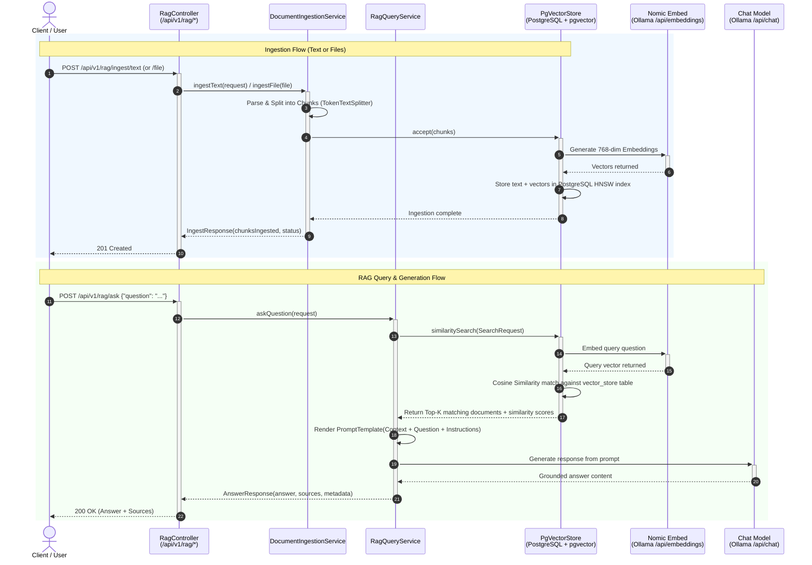

# 🧠 Enterprise RAG Assistant with Spring AI, PgVector & Nomic Embed

An end-to-end Enterprise Retrieval-Augmented Generation (RAG) assistant built using **Spring Boot 3.4.3**, **Spring AI 1.0.0-M6**, **PostgreSQL + pgvector**, **Nomic Embeddings**, and **Ollama LLMs**.

---

## 📐 System Architecture & Flow

### Ingestion & Query Flow

### Complete Sequence Diagram



---

## 🛠️ Tech Stack & Prerequisites

- **Java**: 17+ (JDK 17 LTS)
- **Build Tool**: Maven 3.9+
- **Framework**: Spring Boot `3.4.3` & Spring AI `1.0.0-M6`
- **Vector Database**: PostgreSQL 16 + `pgvector`
- **Embedding Model**: `nomic-embed-text` (768 dimensions via Ollama)
- **Chat LLM**: `qwen3.5:9b` / `llama3.2` / `gemma4:12b` (via Ollama)
- **Containerization**: Docker & Docker Compose

---

## 🚀 Quick Start Guide

### Step 1: Start Infrastructure (Docker Compose)
Inside the `rag-assistant` directory, launch PostgreSQL with pgvector and Ollama:

```bash
docker compose up -d
```

Verify containers are healthy:
```bash
docker ps
```

### Step 2: Download Models in Ollama
Pull the `nomic-embed-text` embedding model and the chat model:

```bash
docker exec -it rag-ollama ollama pull nomic-embed-text
docker exec -it rag-ollama ollama pull qwen3.5:9b
```
*(If you have Ollama installed locally on Windows, simply run `ollama pull nomic-embed-text` and `ollama pull qwen3.5:9b`)*

### Step 3: Build the Project

```bash
mvn clean package -DskipTests
```

### Step 4: Run the Application

```bash
mvn spring-boot:run
```
The server will start listening on `http://localhost:8081`.

---

## 📡 Complete REST API & Testing Examples

### 1️⃣ Ingest Raw Text / Knowledge Notes
**Endpoint:** `POST http://localhost:8081/api/v1/rag/ingest/text`

#### PowerShell
```powershell
Invoke-RestMethod -Uri "http://localhost:8081/api/v1/rag/ingest/text" -Method Post -ContentType "application/json" -Body '{"title":"Travel Policy 2026","category":"HR","content":"All international business flights longer than 4 hours are eligible for Premium Economy booking. Hotel accommodations are reimbursed up to $250 per night. Daily meal allowance is capped at $75 without requiring itemized receipts for amounts under $25."}'
```

#### cURL (Linux / macOS / Git Bash)
```bash
curl -X POST http://localhost:8081/api/v1/rag/ingest/text \
  -H "Content-Type: application/json" \
  -d '{
    "title": "Travel Policy 2026",
    "category": "HR",
    "content": "All international business flights longer than 4 hours are eligible for Premium Economy booking. Hotel accommodations are reimbursed up to $250 per night. Daily meal allowance is capped at $75 without requiring itemized receipts for amounts under $25."
  }'
```

**Expected Response (201 Created):**
```json
{
  "status": "SUCCESS",
  "chunksIngested": 1,
  "documentName": "Travel Policy 2026"
}
```

---

### 2️⃣ Ingest Company Files (PDF, DOCX, TXT, Markdown)
**Endpoint:** `POST http://localhost:8081/api/v1/rag/ingest/file` *(multipart/form-data)*

#### PowerShell (`curl.exe`)
```powershell
curl.exe -X POST "http://localhost:8081/api/v1/rag/ingest/file" -F "file=@C:\path\to\company_handbook.pdf" -F "category=Legal"
```

#### cURL (Linux / macOS / Git Bash)
```bash
curl -X POST http://localhost:8081/api/v1/rag/ingest/file \
  -F "file=@/path/to/company_handbook.pdf" \
  -F "category=Legal"
```

**Expected Response (201 Created):**
```json
{
  "status": "SUCCESS",
  "chunksIngested": 5,
  "documentName": "company_handbook.pdf"
}
```

---

### 3️⃣ Ask a Question (Full RAG Pipeline)
**Endpoint:** `POST http://localhost:8081/api/v1/rag/ask`

#### PowerShell
```powershell
Invoke-RestMethod -Uri "http://localhost:8081/api/v1/rag/ask" -Method Post -ContentType "application/json" -Body '{"question":"What is the policy for flights longer than 4 hours and daily meal allowance?","topK":4,"similarityThreshold":0.50}'
```

#### cURL (Linux / macOS / Git Bash)
```bash
curl -X POST http://localhost:8081/api/v1/rag/ask \
  -H "Content-Type: application/json" \
  -d '{
    "question": "What is the policy for flights longer than 4 hours and daily meal allowance?",
    "topK": 4,
    "similarityThreshold": 0.50
  }'
```

**Expected Response (200 OK):**
```json
{
  "question": "What is the policy for flights longer than 4 hours and daily meal allowance?",
  "answer": "According to the Travel Policy 2026, international business flights longer than 4 hours are eligible for Premium Economy booking. Hotel accommodations are reimbursed up to $250 per night, and the daily meal allowance is capped at $75 without requiring itemized receipts for expenses under $25.",
  "sources": [
    {
      "id": "c71e84df-d8f9-4675-a82f-8a0342cb4120",
      "content": "All international business flights longer than 4 hours are eligible for Premium Economy booking. Hotel accommodations are reimbursed up to $250 per night. Daily meal allowance is capped at $75 without requiring itemized receipts for amounts under $25.",
      "score": 0.891,
      "metadata": {
        "title": "Travel Policy 2026",
        "category": "HR",
        "source": "raw_text"
      }
    }
  ]
}
```

---

## 🔧 Troubleshooting Guide & Known Solutions

### 1. Port 8081 Already in Use (`Web server failed to start`)
- **Symptom:** `org.springframework.context.ApplicationContextException: Failed to start bean 'webServerStartStop'` / `Port 8081 was already in use.`
- **Cause:** A previous instance of the application is running in the background.
- **Fix:** Kill the process holding port 8081:
  ```powershell
  # Windows PowerShell
  $conn = Get-NetTCPConnection -LocalPort 8081 -State Listen -ErrorAction SilentlyContinue
  if ($conn) { Stop-Process -Id $conn.OwningProcess -Force }
  ```
  ```bash
  # Linux / macOS
  lsof -ti:8081 | xargs kill -9
  ```

---

### 2. Ollama Model Not Found (500 Internal Server Error)
- **Symptom:** `500 Internal Server Error` when calling `/api/v1/rag/ask`.
- **Cause:** The chat model configured in `application.yml` is not installed in the local Ollama instance.
- **Fix:** Check available models and ensure the model in `application.yml` matches:
  ```bash
  # Check installed models
  curl http://127.0.0.1:11434/api/tags
  
  # Pull the configured model
  ollama pull nomic-embed-text
  ollama pull qwen3.5:9b
  ```

---

### 3. Ambiguous `EmbeddingModel` Bean Conflict
- **Symptom:**
  ```
  UnsatisfiedDependencyException: No qualifying bean of type 'org.springframework.ai.embedding.EmbeddingModel' available:
  expected single matching bean but found 2: ollamaEmbeddingModel, openAiEmbeddingModel
  ```
- **Cause:** Having multiple AI starters (e.g. `spring-ai-ollama` and `spring-ai-openai`) in `pom.xml` causes Spring AI to create multiple auto-configured `EmbeddingModel` beans.
- **Fix:** Retain only `spring-ai-ollama-spring-boot-starter` for local private embeddings or declare `@Primary` on the intended bean.

---

### 4. Java Version Mismatch (`release 21 not supported`)
- **Symptom:** `Fatal error compiling: error: release version 21 not supported`.
- **Cause:** Local environment is JDK 17, but `pom.xml` was set to Java 21.
- **Fix:** Keep `<java.version>17</java.version>` in `pom.xml`. Spring Boot 3.4.x is fully supported on Java 17 LTS.

---

### 5. pgvector Vector Dimension Mismatch
- **Symptom:** `ERROR: different vector dimensions 1536 and 768`.
- **Cause:** `nomic-embed-text` produces **768-dimensional** vectors. If the table was previously initialized for OpenAI (1536-dim), pgvector rejects the insert.
- **Fix:** Ensure `spring.ai.vectorstore.pgvector.dimensions: 768` in `application.yml`. To reset the schema:
  ```sql
  DROP TABLE IF EXISTS vector_store;
  ```

---

## 📂 Project Structure

```text
rag-assistant/
├── docker-compose.yml              # PostgreSQL + pgvector & Ollama containers
├── pom.xml                         # Maven build file with Spring AI dependencies
├── README.md                       # Comprehensive guide & API documentation
└── src/
    └── main/
        ├── java/com/company/rag/
        │   ├── RagAssistantApplication.java    # Spring Boot entry point
        │   ├── controller/
        │   │   └── RagController.java          # REST API endpoints (/ingest, /ask)
        │   ├── dto/
        │   │   └── RagDto.java                 # Request/Response payloads
        │   ├── exception/
        │   │   └── GlobalExceptionHandler.java # Centralized error & validation handling
        │   └── service/
        │       ├── DocumentIngestionService.java # Tika reader, TokenTextSplitter & PgVector loader
        │       └── RagQueryService.java          # Cosine search, prompt template & LLM invocation
        └── resources/
            └── application.yml                   # Vector store, Ollama & RAG configuration
```
