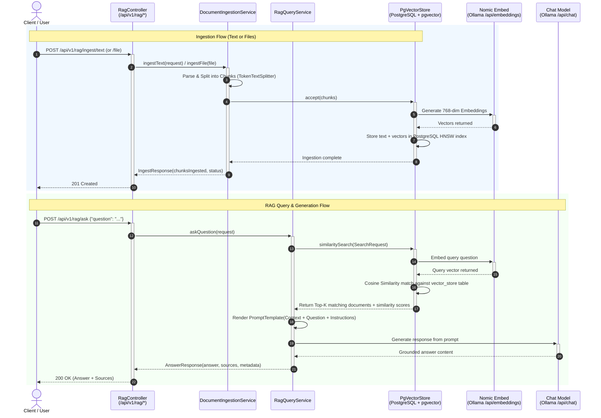

# 🧠 Enterprise RAG Assistant with Spring AI, PgVector & Nomic Embed

An end-to-end Enterprise Retrieval-Augmented Generation (RAG) assistant built using **Spring Boot 3.4.3**, **Spring AI 1.0.0-M6**, **PostgreSQL + pgvector**, **Nomic Embeddings**, and **Ollama LLMs**.

---

## 📐 System Architecture & Flow

### Ingestion & Query Flow

### Complete Sequence Diagram



---

## 🛠️ Tech Stack & Prerequisites

- **Java**: 17+ (JDK 17 LTS)
- **Build Tool**: Maven 3.9+
- **Framework**: Spring Boot `3.4.3` & Spring AI `1.0.0-M6`
- **Vector Database**: PostgreSQL 16 + `pgvector`
- **Embedding Model**: `nomic-embed-text` (768 dimensions via Ollama)
- **Chat LLM**: `qwen3.5:9b` / `llama3.2` / `gemma4:12b` (via Ollama)
- **Containerization**: Podman (Docker-compatible)

---

## 🚀 Quick Start Guide

> **This project uses Spring Boot's Docker Compose integration** — you do **not** need to start containers manually. One command starts everything. See [Infrastructure Bootstrap](#-infrastructure-bootstrap--the-spring-boot-way) for the full story.

### Prerequisites: One-time Podman Shim Setup (Windows only)

Spring Boot's Docker Compose support internally calls `docker` (the binary name). Since this project uses **Podman** instead of Docker, a one-time shim is needed to make `docker` resolve to `podman`. The shim must be a `.exe` because Java's `ProcessBuilder` uses the Win32 `CreateProcess` API which only resolves `.exe`/`.com` — it ignores `.cmd` and `.bat` files.

Run this **once** in PowerShell (requires no admin rights):

```powershell
# Compile a native docker.exe shim that delegates to podman
$src = @'
using System;
using System.Diagnostics;
using System.Text;

class Docker {
    static int Main(string[] args) {
        var sb = new StringBuilder();
        foreach (var a in args) {
            if (a.IndexOf(' ') >= 0 || a.IndexOf('"') >= 0)
                sb.Append('"').Append(a.Replace("\"","\\\"")).Append('"');
            else
                sb.Append(a);
            sb.Append(' ');
        }
        var psi = new ProcessStartInfo();
        psi.FileName = "podman";
        psi.Arguments = sb.ToString().TrimEnd();
        psi.UseShellExecute = false;
        var p = Process.Start(psi);
        p.WaitForExit();
        return p.ExitCode;
    }
}
'@
$tmpSrc = "$env:TEMP\docker_shim.cs"
$outExe = "$env:USERPROFILE\.local\bin\docker.exe"
New-Item -ItemType Directory -Force -Path "$env:USERPROFILE\.local\bin" | Out-Null
Set-Content -Path $tmpSrc -Value $src -Encoding UTF8
& "$env:WINDIR\Microsoft.NET\Framework64\v4.0.30319\csc.exe" /out:$outExe /target:exe /nologo $tmpSrc
Write-Host "Shim created at $outExe"
```

> **Why not `docker.cmd`?**
> PowerShell resolves `.cmd` via `PATHEXT`, but Java's `ProcessBuilder` calls `CreateProcess` directly — it will only find `docker.exe`. A `.cmd` shim works in your terminal but is invisible to the JVM.

Make sure `%USERPROFILE%\.local\bin` is on your `PATH` (it usually is on developer machines). Verify with:
```powershell
docker version --format '{{.Client.Version}}'
# Expected: 5.8.1  (your Podman version)
```

### Run the Application

```bash
mvn spring-boot:run
```

That's it. Spring Boot starts the containers, waits for them to be healthy, wires the datasource, and launches the app — all in one command. The server listens on `http://127.0.0.1:8081`.

---

## 🏗️ Infrastructure Bootstrap — The Spring Boot Way

### The Old Way: Manual Container Management

Before this setup, running the project required three separate manual steps and knowledge of which containers to start and in what order:

```
# Terminal 1 — infrastructure
podman compose up -d
podman ps                          # manually verify health

# Terminal 2 — pull models (only if first time)
podman exec -it rag-ollama ollama pull nomic-embed-text
podman exec -it rag-ollama ollama pull gemma:2b

# Terminal 3 — application
mvn spring-boot:run
```

**Problems with this approach:**
- Three separate steps, easy to forget one or run them out of order
- Application starts even if Postgres hasn't finished initializing → connection errors at startup
- Containers keep running after the app stops → resource waste, stale state between runs
- Every new team member needs to know which `compose.yml` to use and in what order to run things
- CI/local parity is the developer's responsibility

### The New Way: Spring Boot Bootstraps Everything

With `spring-boot-docker-compose` (added to [`pom.xml`](pom.xml)), the entire infrastructure lifecycle is managed by Spring Boot itself:

```
mvn spring-boot:run          ← the only command you need
```

What happens under the hood:

```
Spring Boot starts
  │
  ├─► Detects compose.yml in project root
  │
  ├─► Runs: docker compose -f compose.yml up -d
  │         (docker → shim → podman compose)
  │         Starts: postgres-pgvector, ollama
  │
  ├─► Polls Postgres healthcheck until passing
  │         test: pg_isready -U postgres -d ragdb
  │         interval: 5s, retries: 5
  │
  ├─► Spring auto-configures DataSource, PgVectorStore
  │
  ├─► Application context loads fully
  │
  └─► Server ready on http://127.0.0.1:8081

Ctrl+C
  └─► Spring Boot runs: docker compose down
        Stops and removes containers cleanly
```

### What Makes This Work

#### 1. The Maven dependency

```xml
<!-- pom.xml -->
<dependency>
    <groupId>org.springframework.boot</groupId>
    <artifactId>spring-boot-docker-compose</artifactId>
    <optional>true</optional>   <!-- dev-only, not bundled in the final jar -->
</dependency>
```

Marking it `<optional>true</optional>` means it is only active during local development (`mvn spring-boot:run` or IDE). It is excluded from the final deployable jar — production environments use their own infrastructure.

#### 2. The configuration in `application.yml`

```yaml
spring:
  docker:
    compose:
      enabled: true
      file: compose.yml               # explicit path, no guessing
      lifecycle-management: start-and-stop   # start on boot, stop on exit
      skip-in-tests: true             # never spin up containers during tests
```

| Property | Value | Effect |
|---|---|---|
| `enabled` | `true` | Activates the Docker Compose lifecycle hook |
| `file` | `compose.yml` | Explicit compose file — no ambiguity with `docker-compose.yml` |
| `lifecycle-management` | `start-and-stop` | Containers start with the app and stop when it shuts down |
| `skip-in-tests` | `true` | Unit/integration tests don't spin up real containers |

#### 3. The Postgres healthcheck in `compose.yml`

```yaml
healthcheck:
  test: ["CMD-SHELL", "pg_isready -U postgres -d ragdb"]
  interval: 5s
  timeout: 5s
  retries: 5
```

Spring Boot waits for this healthcheck to pass before proceeding to load the application context. This means the `DataSource` bean is only created after Postgres is **actually ready** — no race conditions, no `Connection refused` errors at startup.

#### 4. The Podman shim (`docker.exe`)

Spring Boot's `DockerCli` class probes for `docker` binary at startup using Java's `ProcessBuilder` (`docker version --format {{.Client.Version}}`). It ignores the `spring.docker.compose.command` property at this detection stage. On Windows, `ProcessBuilder` uses the Win32 `CreateProcess` API which only resolves `.exe` and `.com` — not `.cmd` or `.bat`.

The shim placed at `%USERPROFILE%\.local\bin\docker.exe` is a compiled C# executable that forwards all arguments verbatim to `podman`:

```
Spring Boot: docker version --format {{.Client.Version}}
  → shim: podman version --format {{.Client.Version}}
  → 5.8.1  ✓

Spring Boot: docker compose -f compose.yml up -d
  → shim: podman compose -f compose.yml up -d  ✓
```

### Side-by-side Comparison

| | Manual (`podman compose up -d`) | Spring Boot Auto-Bootstrap |
|---|---|---|
| **Commands to run** | 3+ (compose up, verify, then run app) | 1 (`mvn spring-boot:run`) |
| **Startup order** | Manual responsibility | Guaranteed by Spring Boot |
| **Health gating** | Manual (`podman ps`, eyeball it) | Automatic — app context waits for healthcheck |
| **Shutdown cleanup** | Manual (`podman compose down`) | Automatic on `Ctrl+C` |
| **New developer setup** | Must know which compose file and order | Just run the app |
| **Test isolation** | Risk of tests hitting real containers | `skip-in-tests: true` |
| **Production impact** | N/A — your responsibility | Zero — `<optional>true</optional>` excluded from jar |


---

## 📡 Complete REST API & Testing Examples

### 1️⃣ Ingest Raw Text / Knowledge Notes
**Endpoint:** `POST http://localhost:8081/api/v1/rag/ingest/text`

#### PowerShell
```powershell
Invoke-RestMethod -Uri "http://localhost:8081/api/v1/rag/ingest/text" -Method Post -ContentType "application/json" -Body '{"title":"Travel Policy 2026","category":"HR","content":"All international business flights longer than 4 hours are eligible for Premium Economy booking. Hotel accommodations are reimbursed up to $250 per night. Daily meal allowance is capped at $75 without requiring itemized receipts for amounts under $25."}'
```

#### cURL (Linux / macOS / Git Bash)
```bash
curl -X POST http://localhost:8081/api/v1/rag/ingest/text \
  -H "Content-Type: application/json" \
  -d '{
    "title": "Travel Policy 2026",
    "category": "HR",
    "content": "All international business flights longer than 4 hours are eligible for Premium Economy booking. Hotel accommodations are reimbursed up to $250 per night. Daily meal allowance is capped at $75 without requiring itemized receipts for amounts under $25."
  }'
```

**Expected Response (201 Created):**
```json
{
  "status": "SUCCESS",
  "chunksIngested": 1,
  "documentName": "Travel Policy 2026"
}
```

---

### 2️⃣ Ingest Company Files (PDF, DOCX, TXT, Markdown)
**Endpoint:** `POST http://localhost:8081/api/v1/rag/ingest/file` *(multipart/form-data)*

#### PowerShell (`curl.exe`)
```powershell
curl.exe -X POST "http://localhost:8081/api/v1/rag/ingest/file" -F "file=@C:\path\to\company_handbook.pdf" -F "category=Legal"
```

#### cURL (Linux / macOS / Git Bash)
```bash
curl -X POST http://localhost:8081/api/v1/rag/ingest/file \
  -F "file=@/path/to/company_handbook.pdf" \
  -F "category=Legal"
```

**Expected Response (201 Created):**
```json
{
  "status": "SUCCESS",
  "chunksIngested": 5,
  "documentName": "company_handbook.pdf"
}
```

---

### 3️⃣ Ask a Question (Full RAG Pipeline)
**Endpoint:** `POST http://localhost:8081/api/v1/rag/ask`

#### PowerShell
```powershell
Invoke-RestMethod -Uri "http://localhost:8081/api/v1/rag/ask" -Method Post -ContentType "application/json" -Body '{"question":"What is the policy for flights longer than 4 hours and daily meal allowance?","topK":4,"similarityThreshold":0.50}'
```

#### cURL (Linux / macOS / Git Bash)
```bash
curl -X POST http://localhost:8081/api/v1/rag/ask \
  -H "Content-Type: application/json" \
  -d '{
    "question": "What is the policy for flights longer than 4 hours and daily meal allowance?",
    "topK": 4,
    "similarityThreshold": 0.50
  }'
```

**Expected Response (200 OK):**
```json
{
  "question": "What is the policy for flights longer than 4 hours and daily meal allowance?",
  "answer": "According to the Travel Policy 2026, international business flights longer than 4 hours are eligible for Premium Economy booking. Hotel accommodations are reimbursed up to $250 per night, and the daily meal allowance is capped at $75 without requiring itemized receipts for expenses under $25.",
  "sources": [
    {
      "id": "c71e84df-d8f9-4675-a82f-8a0342cb4120",
      "content": "All international business flights longer than 4 hours are eligible for Premium Economy booking. Hotel accommodations are reimbursed up to $250 per night. Daily meal allowance is capped at $75 without requiring itemized receipts for amounts under $25.",
      "score": 0.891,
      "metadata": {
        "title": "Travel Policy 2026",
        "category": "HR",
        "source": "raw_text"
      }
    }
  ]
}
```

---

## 🔧 Troubleshooting Guide & Known Solutions

### 1. Spring Boot Cannot Find `docker` Binary (`DockerProcessStartException`)
- **Symptom:**
  ```
  DockerProcessStartException: Unable to start docker process. Is docker correctly installed?
  Caused by: java.io.IOException: Cannot run program "docker": CreateProcess error=2
  ```
- **Cause:** Spring Boot's `DockerCli` always probes for a binary literally named `docker` using Java's `ProcessBuilder`, which calls the Win32 `CreateProcess` API. This API only resolves `.exe` and `.com` extensions — `.cmd` and `.bat` shims are invisible to it. Setting `spring.docker.compose.command=podman` does **not** bypass this initial binary probe.
- **Fix:** Create a native `docker.exe` shim (see [Prerequisites: One-time Podman Shim Setup](#prerequisites-one-time-podman-shim-setup-windows-only)) once. It delegates every call to `podman` transparently.

---

### 2. Port 8081 Already in Use (`Web server failed to start`)
- **Symptom:** `org.springframework.context.ApplicationContextException: Failed to start bean 'webServerStartStop'` / `Port 8081 was already in use.`
- **Cause:** A previous instance of the application is running in the background.
- **Fix:** Kill the process holding port 8081:
  ```powershell
  # Windows PowerShell
  $conn = Get-NetTCPConnection -LocalPort 8081 -State Listen -ErrorAction SilentlyContinue
  if ($conn) { Stop-Process -Id $conn.OwningProcess -Force }
  ```
  ```bash
  # Linux / macOS
  lsof -ti:8081 | xargs kill -9
  ```

---

### 3. Ollama Model Not Found (500 Internal Server Error)
- **Symptom:** `500 Internal Server Error` when calling `/api/v1/rag/ask`.
- **Cause:** The chat model configured in `application.yml` is not installed in the local Ollama instance.
- **Fix:** Check available models and ensure the model in `application.yml` matches:
  ```bash
  # Check installed models
  curl http://127.0.0.1:11434/api/tags
  
  # Pull the configured model
  ollama pull nomic-embed-text
  ollama pull qwen3.5:9b
  ```

---

### 4. Ambiguous `EmbeddingModel` Bean Conflict
- **Symptom:**
  ```
  UnsatisfiedDependencyException: No qualifying bean of type 'org.springframework.ai.embedding.EmbeddingModel' available:
  expected single matching bean but found 2: ollamaEmbeddingModel, openAiEmbeddingModel
  ```
- **Cause:** Having multiple AI starters (e.g. `spring-ai-ollama` and `spring-ai-openai`) in `pom.xml` causes Spring AI to create multiple auto-configured `EmbeddingModel` beans.
- **Fix:** Retain only `spring-ai-ollama-spring-boot-starter` for local private embeddings or declare `@Primary` on the intended bean.

---

### 5. Java Version Mismatch (`release 21 not supported`)
- **Symptom:** `Fatal error compiling: error: release version 21 not supported`.
- **Cause:** Local environment is JDK 17, but `pom.xml` was set to Java 21.
- **Fix:** Keep `<java.version>17</java.version>` in `pom.xml`. Spring Boot 3.4.x is fully supported on Java 17 LTS.

---

### 6. pgvector Vector Dimension Mismatch
- **Symptom:** `ERROR: different vector dimensions 1536 and 768`.
- **Cause:** `nomic-embed-text` produces **768-dimensional** vectors. If the table was previously initialized for OpenAI (1536-dim), pgvector rejects the insert.
- **Fix:** Ensure `spring.ai.vectorstore.pgvector.dimensions: 768` in `application.yml`. To reset the schema:
  ```sql
  DROP TABLE IF EXISTS vector_store;
  ```

---

## 📂 Project Structure

```text
rag-assistant/
├── compose.yml                     # PostgreSQL + pgvector & Ollama containers (auto-managed by Spring Boot)
├── pom.xml                         # Maven build file with Spring AI dependencies
├── README.md                       # Comprehensive guide & API documentation
└── src/
    └── main/
        ├── java/com/company/rag/
        │   ├── RagAssistantApplication.java    # Spring Boot entry point
        │   ├── controller/
        │   │   └── RagController.java          # REST API endpoints (/ingest, /ask)
        │   ├── dto/
        │   │   └── RagDto.java                 # Request/Response payloads
        │   ├── exception/
        │   │   └── GlobalExceptionHandler.java # Centralized error & validation handling
        │   └── service/
        │       ├── DocumentIngestionService.java # Tika reader, TokenTextSplitter & PgVector loader
        │       └── RagQueryService.java          # Cosine search, prompt template & LLM invocation
        └── resources/
            └── application.yml                   # Vector store, Ollama & RAG configuration
```
